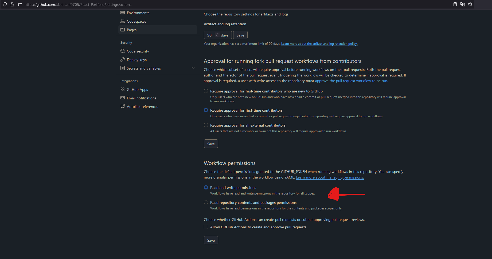

# Ebrahim Ghani's React Portfolio

Welcome to the source code repository of my professional React portfolio. This application showcases my journey as a Software Engineer and Full Stack Developer, highlighting my projects, skills, and the experiences that have shaped my career.

## Deployment

This project uses GitHub Actions for continuous integration and continuous deployment (CI/CD). Here's how it works:

1. When you push changes to the main branch, GitHub automatically triggers the CI/CD workflow.
2. The workflow performs the following tasks:
    - Installs dependencies
    - Builds the project using `npm run build`
    - Deploys the built files to the `gh-pages` branch
    - Updates the GitHub Pages site with the new content

You don't need to manually run any deployment commands (i.e., `npm run build && npm run deploy`). Simply pushing changes to the main branch will automatically update your live site on GitHub Pages.

### Important Notes:

-   Never commit directly to the `gh-pages` branch. Always push changes to the main branch.
-   The site will be available at: https://yourusername.github.io/your-repo-name

    -   For me I'm hosting on a personal domain: https://temp

-   Make sure that you give GitHub Actions writing permissions, otherwise it won't be able to deploy the changes
    

## About the Portfolio

Built with React.js, this portfolio is designed to provide an informative and interactive experience for recruiters and peers interested in exploring my work.

## Running the Portfolio Locally

To get a local copy up and running, follow these steps:

### Prerequisites

-   Node.js (LTS version)
-   npm (bundled with Node.js)
-   Git

### Installation

1. Clone the repository:
    ```sh
    git clone https://github.com/ebrahimghani197/React-Portfolio.git
    ```
2. Navigate to the project directory:
    ```sh
    cd React-Portfolio
    ```
3. Install the dependencies:
    ```sh
    npm install
    ```
4. Start the application:
    ```sh
    npm start
    ```

The portfolio should now be running at [http://localhost:3000](http://localhost:3000) in your default web browser.

## Technologies Used

-   **React.js**: The primary framework for building the user interface.
-   **Node.js**: JavaScript runtime environment for backend compatibility.
-   **npm**: Package manager for handling project dependencies.
-   **HTML5/CSS3/Sass**: Markup and styling languages for creating the visual elements.
-   **Bootstrap**: CSS framework for achieving a responsive layout.

## Learning Outcomes

Developing this portfolio has deepened my understanding of:

-   React's component lifecycle and state management.
-   Responsive design principles using Bootstrap.
-   The importance of code organization and modular design in complex applications.
-   SEO best practices and web performance optimization.

## Contributions

While this is a personal portfolio, I welcome suggestions and contributions that can enhance the project. Feel free to fork the repository, make changes, and submit a pull request.

## Connect With Me

If you'd like to discuss this project, provide feedback, or explore collaboration opportunities, you can reach me through:

-   [](https://github.com/ebrahimghani197)
-   [](https://linkedin.com/in/ebrahimghani197)
-   [](mailto:Dragonfury197@hotmail.com)
<!-- - [](https://www.instagram.com/) -->

Thank you for visiting my portfolio repository!
